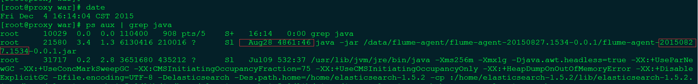

# flume-agent

Author: Black

log4j socket 集中收集日志 服务端，并将日志写入文件,允许自定义配置

线上稳定运行3个月以上，从未出现过问题




## log4j clien (Your Java App)

log4j.xml

````xml
<?xml version="1.0" encoding="UTF-8"?>
<!DOCTYPE log4j:configuration SYSTEM "log4j.dtd">

<log4j:configuration>

    <appender name="CENTER-LOG4j" class="org.apache.log4j.AsyncAppender">
        <param name="Blocking" value="false"/>
        <param name="BufferSize" value="500"/>
        <appender-ref ref="socket"/>
    </appender>

    <appender name="socket" class="org.apache.log4j.net.SocketAppender">
        <param name="application" value="myappName"/>
        <param name="remoteHost" value="${log4j.host}"/>
        <param name="port" value="4561"/>
        <param name="reconnectionDelay" value="10"/>
        <param name="locationInfo" value="true"/>
        <param name="threshold" value="DEBUG"/>
    </appender>
    
	<root>
		<priority value="DEBUG" />
		<appender-ref ref="CONSOLE" />
        <appender-ref ref="CENTER-LOG4j"/>
	</root>

</log4j:configuration>  
````

## java run:

  `bin/start.sh`

## docker run

   docker REPOSITORY: registry.xxx.com/log4j.xxx.com

1. docker-compose.yml


````
log4j:
    image: registry.xxx.com/log4j.ezhe.com
    ports:
        - 4562:4562 
    environment:
        LC_ALL: en_US.UTF-8
    volumes:
        - /etc/sysconfig/
        - /data/flume-agent/logs/
        - /data/flume-agent/conf/:/data/log4j/conf/
        
````

````
docker-compose up -d
````
   
2. docker-log4j.sh

````sh
#!/bin/sh

dockerRepo=registry.xxx.com
appname=log4j.xxx.com
if [ -n "$appname" -a -n "$appport" ]; then
    echo "docker pull $appname "
    docker pull $dockerRepo/$appname
    echo "docker run $dockerRepo/$appname "
    docker ps -a | grep $appname | awk '{print $1}' | xargs docker rm -f
    docker run -d -p $appport:4562 -h $appname --name $appname-$appport -v /etc/sysconfig:/etc/sysconfig -v /data/flume-agent/logs:/data/flume-agent/logs -v /data/flume-agent/conf/:/data/log4j/conf/ $dockerRepo/$appname
else 
    echo "usage : "
    echo "    ./docker-log4j.sh"
    echo " "
fi
````

## 扩展

搭配 Keepalive/deamontools


---------------------------